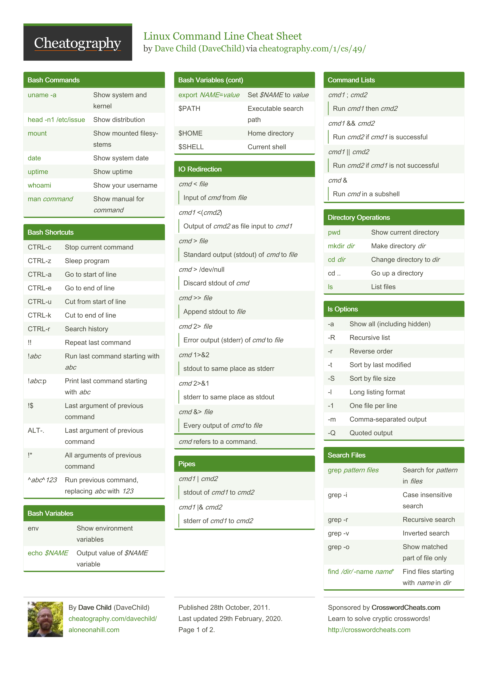
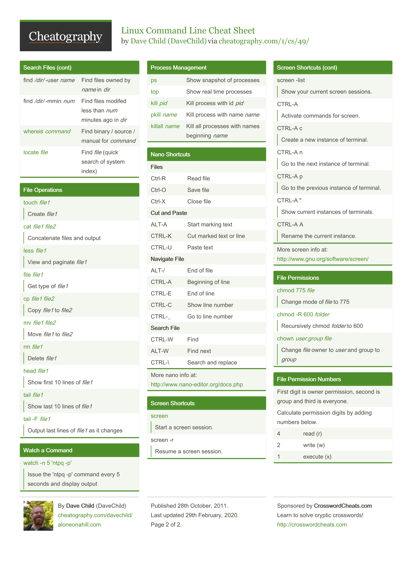

# Linux Shell commands cheat sheet #

<br />
<br />

<div itemscope>
<h2 align=center
    tabindex=1
    itemprop="heading"
> 
Example commands 
</h2>
</div>

Command | Description
---|---|
date | print or set the system date and time
cal | display a caldendar
df | report file system space usage
free | display amount of free used memory in system
exit | ends terminal session


<div itemscope>
<h2 align=center
    tabindex=1
    itemprop="heading"
> 
Navigation 
</h2>
</div>

<br />

Command | Description
---|---|
pwd | print name of current/working directory
cd | change the working directory
ls | list directory contents

<br />

E.g. commands with options and arguments

```
ls -lth --reverse -S
```
* **-l**  :display results in long format
* **-t**  :sort by modification time
* **-h**  :display file sizes in human-readble format rather then in bytes
* **-S**  :sort results by file size
* **--reverse**  :displays the result in reverse order


<br />

<div itemscope>
<h2 align=center
    tabindex=1
    itemprop="heading"
> 
Exploring the file system 
</h2>
</div>

<br />

Command | Description
---|---|
file | determine file type
less | opposite of more

E,g. commands with options and arguments

```
[me@linuxbox ˜]$ file picture.jpg
picture.jpg: JPEG image data, JFIF standard 1.01
```

Using **less** :

Command | Description
---|---|
page up or b | scroll back one page
page down or spacebar | scroll forware one page
Up Arrow | Scroll up one line
Down Arrow | Scroll down one line
G | Move to the end of the text line
1G or g | Move to the beginning of the text file
n | search for the next occurrence of the previous search
q | Quit **less**

***less is more!!*** - from a class of programs called *pagers* allowing easy viewing of long text documents in a page-by-page manner.

<br />

<div itemscope>
<h2 align=center
    tabindex=1
    itemprop="heading"
> 
Linux file system structure
</h2>
</div>

<br />

Directory/File | Comment
---|---|
/ |root directory
/bin | contains binaries that must be present for the system to boot and run
/boot | contains the linux kernel, initial RAM disk image
/boot/grub/grub.conf | - menu.lst (boot loader)
/boot/vmlinuz | the kernel
/dev | device nodes - everything is a file, kernal maintains a list of all devices it understands
/etc | system-wide configuration files, shell scripts starting system services at boot time
/etc/crontab | file defining when automated jobs will run
/etc/fstab | a table of storage devices and their associated mount points
/etc/passwd | list of user accounts
/home | user home directory
/lib | shared library files used by core system programs. Similar to DLLs in Windows
/lost+found | used for partial recovery from corruption event.
/media | mount points for removable media
/mnt | contains mount points for removable devices mounted manually
/opt | used to install optional software, commercial products 
/proc | virtual filesystem maintained by linux kernel, looking glass to kernal itself
/root | home dir for root
/sbin | system binaries, programs performing vital tasks reserved to superuser
/tmp | intended for temporary files storage
/usr | likely largest dir, contains programs and support files used by regular users
/usr/bin | exec programs installed by linux distribution
/usr/lib | shared libraries for /usr/bin programs
/usr/local | system wide usable programs, install by system administrators
/usr/sbin | more system administration programs
/usr/share | contains all the shared data used by programs in /usr/bin. Config files,icons,screen backgrounds
/usr/share/doc | documentation folder
/var | dynamic directory(content). Databases, spool files, user mail
/var/log | contains log files, viewed by superuser e.g /var/log/messages

<br />

<div itemscope>
<h2 align=center
    tabindex=1
    itemprop="heading"
> 
Manipulating files and directories
</h2>
</div>

<br />


Command | Description
---|---|
cp | copy files and directories
mv | move (rename) files
mkdir | make directories
rm | remove files or directories
ln | make links between files

<br />

E.g. command description

<br />

```
mkdir directory...
mkdir dir1
mkdir dir1 dir2 dir3
```
```
cp item1 item2
cp item.. directory
```
```
mv item1 item2
mv item... directory
```

```
ln file link
ln -s item link
```

* **-i**  :propmts the user for confirmation, interactive
* **-u**  :performs operation only if either file/directory doesn't exist, or is newer
* **-v**  :displays informative messages as the move is performed
* **-r**  :with copy recursively copies directories and their contents


<br />

<div itemscope>
<h2 align=center
    tabindex=1
    itemprop="heading"
> 
Working with Commands
</h2>
</div>

<br />

Command | Description
---|---|
type | write a description of a command type
which | shows the full path of (shell) commands.
man | an interface to the system reference manuals
apropos | search the manual page names and descriptions
info | read the info documents
whatis | display one-line manual page descriptions
alias | define or display aliases

### E.g. commands ###

```
alias foo='cd /usr; ls; cd -' # creates an alias named foo
unalias foo # removes an alias
```
```
apropos floppy
whatis ls
info info
```

<br />

## man program sections:

<br />

Section | Purpose
---|---|
1|user commands
2|programming interfaces for kernel calls
3|program interfaces to the C library
4|special files such as device nodes and drivers
5|file formats
6|ganes abd amusements such as screensavers
7|miscellaneous
8|system administrator commands


<br />

### command composition ###

<br />

```
cd /usr; ls; cd -;
```
( short circuiting with boolean operators - no evaluation if left command exits with non-zero )

```
cd /usr && ls && cd -
```


<br />

<div itemscope>
<h2 align=center
    tabindex=1
    itemprop="heading"
> 
Redirection
</h2>
</div>

<br />


Command | Description
---|---|
cat | Concatenate files and print on the standard output
sort | Sort lines of text files
uniq | Report or omit repeated lines
wc | Print newline, word, and byte counts for each file
grep | Print lines matching a pattern
head | output the first part of a file
tail | output the last part of files
tee | Read from standard input and write to standard output and files


### redirection from standard output

```
ls -l file.text  #lists file in directory
ls -l > file.txt  #lists directory content redirecting output to file.txt
> file.txt -- clears file.txt
```

### shell file descriptors ###

File descriptor| Resource
---|---|
0 | standard input
1 | standard output
2 | standard error 

### file descriptor usage ###


Expression | Action
---|---|
2> | redirect from stderr
2>&1 | redirect from file descriptor 2 (stderr) to 1(stdout)

```
ls -l /bin/usr 2> ls-error.txt  # redirecting from standard error
ls -l /bin/usr > ls-output.txt 2>&1  # redirecting from stout and stderr to one file
ls -l /bin/usr 2> /dev/null  # disposing of unwanted output
```

### Pipelines ###

using filters with pipelines
```
ls /bin/usr | sort | less
ls /bin /usr/bin | sort | uniq | grep zip
ls /usr/bin | tail -n 5
ls /usr/bin | tee ls.txt | grep zip # the tee program reads standard input and copies it to both standard output ( allowing the data to continue down the pipeline ) and to one or more files
```


<div itemscope>
<h2 align=center
    tabindex=1
    itemprop="heading"
> 
Seeing the world as the shell sees it
</h2>
</div>

<br />

### Expansion ###

<br />

```
echo *
echo D* 
echo *s
echo /usr/*/share 
echo ~ # expansion to home directory
echo $((2+2)) # arithmetic expansion
echo with $((5%2)) left over.
```
<br />

### Brace Expansion ###
> creates multiple text strings from a pattern containing braces


```
echo Front-{A,B,C}-Back
echo Number_{1..5}
echo {Z..A}
echo a{A{1,2},B{3,4}}b
```

<br />

### Parameter Expansion ###

<br />

```
echo $USER
printenv | less
```

<br />

### Command Substitution ###
> uses the output of a command as an expansion


```
echo $(ls)
ls -l $(which cp)
```
```
file $(ls /usr/bin/* | grep zip)
ls -l `which cp` # alternative syntax for command substitution
```

**_Note_**: _The order of expansions is: brace expansion; tilde expansion, parameter and variable expansion, arithmetic expansion, and command substitution (done in a left-to-right fashion); word splitting; and filename expansion._

<br />

### Quoting ###
> allows for selective suppression of unwanted expansions

* double quotes - special characters used by the shell lose their special meaning and are treated as ordinary characters. Exceptions: $ (dollar sign), \ (backlash), and `(back tick)`
* single quotes - used to suppress all expansions
```
[me@linuxbox ˜]$ echo "text ˜/*.txt {a,b} $(echo foo) $((2+2)) $USER"
text ˜/*.txt {a,b} foo 4 me
```


<div itemscope>
<h2 align=center
    tabindex=1
    itemprop="heading"
> 
Advanced Keyboard Tricks
</h2>
</div>


Commands | Description
---|---|
clear | clear the terminal screen
history | manipulate the history list

### Terminal cursor movement ###

Key | Action
---|---|
ctrl-A| Move cursor to the beginning of the line
ctrl-E| Move cursor to the end of the line
ctrl-F| Move cursor forward one character; smae as the right arrow key
ctrl-B| Move cursor backward one character; same as the left arrow key
alt-F| Move cursor forward one word
alt-B| Move cursor backward one word
ctrl-L| Clear the scren and move the cursor to the top left corner. Same as *clear* command

### Modifying/Cutting and Pasting Text ###

Key | Action
---|---|
ctrl-D| Delete character at the cursor location
ctrl-T| Transpose (exchange) the character at the cursor location with the one preceding it.
alt-T| Transpose the word at the cursor location with the one preceding it.
alt-L| Convert the characters from the cursor location to the end of the word to lowercase.
alt-U| Convert the characters from the cursor location to the end of the word to uppercase.
ctrl-K| Kill text from the cursor location to the end of the line.
ctrl-U| Kill text from the cursor location to the beginning of the line.


<div itemscope>
<h2 align=center
    tabindex=1
    itemprop="heading"
> 
Permissions
</h2>
</div>

Commands | Description
---|---|
id | print real and effective user and group IDs
chmod | change file mode bits
umask | get or set the file mode creation mask
su | run a command with substitute user and group ID
sudo | execute a command as another user
chown | change file owner and group
chgrp | change group ownership
passwd | change user password

```
[me@linuxbox ˜]$ id
uid=500(me) gid=500(me) groups=500(me)
```
```
[me@linuxbox ˜]$ umask
0002
```

### chmod ###

> octal representation

Octal | Binary | File Mode
---|---|---|
0|000|---
1|001|--x
2|010|-w-
3|011|-wx
4|100|r--
5|101|r-x
6|110|rw-
7|111|rwx


```
chmod u+s program # setuid
```
```
chmod +t dir # assign the sticky bit to a directory
```

### Symbolic Repr ###

Symbol | Meaning
---|---|
u | short for user but means the file or directory owner
g | Group owner
o | Short for tothers but means world
a | Short for all; the combination of u,g, and o

Notation | Meaning
---|---|
u+x | Add execute permission for the owner
u-x | Remove execute permission from the owner
+x | Add execute permission for the owner, group, and world. Equivalent a+x.
o-rw | Remove the read and write permissions from anyone besides the owner and group owner
go=rw | Set the group owner and anyone besides the owner to have read and write permission. If either the group woener or world previously had execute permissions, remove them.
u+x | Add execute permission for the owner and set the permissions for the group and others to read and execute. Multiple specifications may be separated by commas.


### su, sudo ###

```
[me@linuxbox ˜]$ su- # shell start for superuser
```